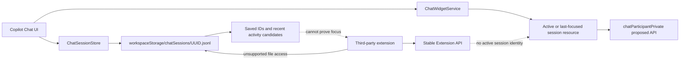

# Research Overview

> 適用範囲: 0.1 時点の実現性調査。0.2.x で追加した明示 opt-in の使用量分析（選択した1セッションの JSON/JSONL を worker で解析し、概要だけを保持）は [20260806-ai-credits-fixture-gate.md](20260806-ai-credits-fixture-gate.md) を正とする。

## 目的

VS Code のステータスバーやコマンドから、現在の GitHub Copilot Chat セッション ID を表示・コピーする拡張機能を実現できるか調査した。

調査対象は次の3段階に分けた。

1. Marketplace で配布できる stable Extension API
2. Insiders とローカル VSIX に限定した proposed/private API
3. Desktop の内部保存データを読む best-effort 実装

## 調査時点と実機

- 調査日: 2026-08-05
- OS: Windows 11
- VS Code: 1.131.0 (`e4c7e7b1d6d060162f4aa7f8225271b67ce1df75`, x64)
- 実機では `chatSessions/<UUID>.jsonl` のファイル名、初期メタデータの `sessionId`、Copilot debug log の `sid` が同一 UUID であることを確認した
- 実機の JSONL storage version は 3、初期 location は `panel` だった
- 実セッション UUID や会話本文は本レポートに記録しない

# TL;DR

**拡張機能は作れる。ただし、stable API だけで「現在アクティブな Copilot Chat セッション ID」を正確に表示する Marketplace 版は、現時点では作れない。**

- stable の `ChatRequest` / `ChatContext` には session ID がない。`vscode.env.sessionId` は VS Code の起動セッション ID であり、Chat ID ではない。[^1]
- 正確な panel session resource は private proposed API の `window.activeChatPanelSessionResource` に存在する。一般の公開拡張向け stable API ではない。[^2]
- proposed API を使う拡張は Marketplace に公開せず、Insiders と手動有効化で共有するのが公式方針である。[^3]
- Desktop では内部の `chatSessions/<UUID>.jsonl` から保存済み ID を列挙できる。[^4] ただし focused/active 状態は in-memory の `ChatWidgetService` が管理するため、最新更新ファイルを「現在のセッション」と断定できない。[^5]
- したがって、現実的な初版は **ローカル VSIX の実験版**として「Current」ではなく「Recent Chat ID」または「候補 ID」を表示する形になる。

# 判定

| 目標                                              | 判定                   | 理由                                                              |
| ------------------------------------------------- | ---------------------- | ----------------------------------------------------------------- |
| Stable + Marketplace で正確な current ID          | 不可                   | active session を返す stable API がない                           |
| Insiders + ローカル VSIX で active panel resource | 条件付きで可能         | private proposed API と手動有効化が必要                           |
| Stable Desktop で保存済み ID 一覧                 | 可能だが非公開仕様依存 | `chatSessions/*.json[l]` のファイル名を列挙できる                 |
| Stable Desktop で直近活動 ID                      | best-effort で可能     | mtime や file watcher は focus を保証しない                       |
| Web (`vscode.dev` / `github.dev`)                 | 不可                   | Node.js/fs とローカル user data にアクセスできない                |
| Remote/WSL                                        | 要検証                 | UI/workspace extension host と user-data/profile の所在が分かれる |

# 詳細

## 1. Stable API には Chat session identity がない

stable の `ChatRequest` が公開するのは prompt、command、references、model、tool 関連情報である。`ChatContext` は participant に渡す history を持つが、session ID や active session resource は持たない。[^1]

`vscode.env.sessionId` という名前の API は存在するが、これは VS Code を起動するたびに変わる editor session の識別子であり、Copilot Chat conversation の ID ではない。[^1]

他拡張との正規連携手段として `extensions.getExtension(...).exports` はあるが、GitHub Copilot が current session を返す公開 extension API を export している公式仕様は確認できなかった。[^1]

## 2. 必要な API は private proposed に存在する

`vscode.proposed.chatParticipantPrivate.d.ts` には次が定義されている。[^2]

- `window.activeChatPanelSessionResource: Uri | undefined`
- `window.onDidChangeActiveChatPanelSessionResource`
- `ChatRequest.sessionResource`
- 旧 `ChatRequest.sessionId`

つまり VS Code 内部には必要な情報とイベントがある。ただし注意点がある。

- 値は raw UUID ではなく `Uri` であり、opaque resource として扱うべき
- 名前どおり chat panel 向けで、すべての editor/quick chat surface を一律に表す保証はない
- private proposed API なので互換性保証がない
- proposed API は Insiders、`enabledApiProposals`、起動時の明示的な有効化を前提とする
- 公式には proposed API 利用拡張を Marketplace へ公開すべきではない[^3]

focus event の stable 化要望は提出されたが、2026-06-07 に必要な upvote 数へ届かず `not planned` でクローズされた。[^6]

## 3. `chatSessionsProvider` は observer API ではない

`vscode.proposed.chatSessionsProvider.d.ts` は、拡張自身が chat session provider/controller として所有する session を作成・表示するための API である。`ChatSessionItem.resource` は session の一意な URI だが、Copilot/VS Code が所有する既存 session を第三者拡張が列挙する API ではない。[^7]

この不足を埋める read-only observation API の要望が提出されており、issue 自体も current workaround として private JSONL、SQLite、file watcher を挙げ、それらが fragile であると説明している。[^8]

## 4. 内部保存データから ID 自体は取得できる

VS Code 本体の `ChatSessionStore` は通常の workspace について、次の位置を使う。[^4]

```text
<workspaceStorageHome>/<workspace-id>/chatSessions/<sessionId>.jsonl
```

互換性上、旧 `.json` も読まれる。空ウィンドウでは default profile の `globalStorageHome/emptyWindowChatSessions` が使われ、workspace の遷移時には保存場所の migration も行われる。[^4]

実機では以下の3点が一致した。

```text
chatSessions/<UUID>.jsonl
GitHub.copilot-chat/debug-logs/<UUID>/main.jsonl の sid
JSONL 初期レコード v.sessionId
```

したがって、**保存済み session の ID を列挙するだけなら本文を解析せずファイル名から取得できる**。UUID 形式を検証し、本文を開かない設計が最もデータ最小化しやすい。

## 5. 保存ファイルだけでは active/focused を決められない

VS Code の active/focused 状態は `ChatWidgetService` の widget collection と `lastFocusedWidget`、`onDidChangeFocusedSession` などで管理される。[^5]

一方、`chatSessions` のファイル更新時刻が表すのは保存活動であり、次を区別できない。

- panel と chat editor の切り替え
- 複数 chat editor の focus 移動
- background session の更新
- 複数 window が同じ workspace を開く状況
- session を切り替えたが新しい request をまだ送っていない状況
- autosave、migration、metadata-only update

そのため、`最新 mtime = current session` や「99.9% 正確」といった表現には根拠がない。表示するなら `Recent Chat ID`、`Last saved session`、`候補` などに限定する必要がある。

同じ API gap は language model provider や tool provider からも報告されている。active panel を見るだけでは background request や focus change と request ownership を結び付けられないとの指摘がある。[^9]

## 6. Debug log 解析は採用しない

Copilot Chat の log や trace には session ID が現れる場合がある。過去の issue でも UUID 形式の `sessionId` が確認できる。[^10]

ただし公式ドキュメントは log を接続問題などのトラブルシュートや Support 共有に使うものとして案内しており、常時監視 API として契約していない。[^11]

debug log 方式には次の問題がある。

- log level や preview/debug logging 設定に依存し得る
- prompt、tool input/output、ファイル情報などを含み得る
- rotation と schema が非公開
- `VSCODE_TARGET_SESSION_LOG` は常に存在する保証がなく、参照 session と owning session がずれるケースも報告されている[^9]
- 最新 log も focus の証明にはならない

初版 PoC は debug log を読まず、`chatSessions` のファイル名だけを対象にする方がよい。

## 7. JSONL は互換性契約ではない

`ChatSessionStore` には `.json` から `.jsonl` への移行、設定による log storage の切り替え、index version、旧形式の backfill が実装されている。[^4] 実際に metadata 初期行の欠落で session を再オープンできなくなった報告もある。[^12]

したがって、内部 storage を使う場合は次を前提にする。

- VS Code version ごとの compatibility test が必要
- schema parse 失敗は正常な非対応状態として扱う
- session file を変更しない
- JSONL 本文を前提にせず、可能ならファイル名だけを読む
- 旧 `.json` と empty-window storage は段階的対応にする

## 8. Platform と配布上の制約

### Desktop

Node.js extension host はローカルファイルを読める。VS Code 拡張は VS Code 本体と同等の権限を持ち、ファイル読み書き、network request、外部 process 起動も可能である。[^13] 技術的に読めることと、安定 API としてサポートされることは別である。

### Web

Web extension host は Browser WebWorker で動き、Node.js APIs を使えない。workspace と extension storage も virtual filesystem になる。[^14] ローカル VS Code user-data の sibling directory を走査する方式は成立しない。

### Remote / WSL / SSH / Codespaces

VS Code には local、web、remote の extension host があり、`extensionKind` と install location により実行場所が決まる。[^15] `extensionKind: ["ui"]` はローカル実行を優先できるが、Chat storage の profile/user-data 所在と拡張から見える filesystem の対応は構成別に検証が必要である。

固定 `%APPDATA%` は使えない。Stable/Insiders、portable mode、custom `--user-data-dir`、profile、Remote の違いで破綻する。

### Workspace Trust

この拡張が workspace code を実行せず、内部 session filename の読み取りだけを行うなら Restricted Mode 対応は可能と考えられる。ただし Workspace Trust は他機能の private data へのアクセス許可機構ではない。manifest では意図を明示して検証する必要がある。[^16]

### Privacy

Chat の入力、AI output、code、text、document、image は Personal Data を含み得る。第三者拡張を利用した場合、その第三者の privacy policy が適用される。[^17]

PoC は次を守るべきである。

- 明示的 opt-in
- local-only
- network/telemetry なし
- UUID filename だけを読む
- prompt/title/response/reference を読まない
- session file を書き換えない
- README で非公開仕様依存と対応範囲を明記する

Marketplace は malware scan、dynamic detection、secret scanning、block list などを備える。[^13] 他拡張の内部 storage を読むだけで必ず審査拒否になるという明示規定は確認できないが、企業 allowlist と利用者の信頼上は高リスクな実装である。

# 構成図



# 実装方式の比較

| 方式                             | ID取得            | Current判定       | Marketplace  | 主な問題                          |
| -------------------------------- | ----------------- | ----------------- | ------------ | --------------------------------- |
| Stable Chat API                  | 不可              | 不可              | 可           | session identity がない           |
| `vscode.env.sessionId`           | 値は取れる        | 誤り              | 可           | Chat ID ではない                  |
| `activeChatPanelSessionResource` | URI取得           | panel は高精度    | 原則不可     | private proposed、surface限定     |
| `chatSessionsProvider`           | 自分のsessionのみ | 自分のsessionのみ | proposed     | Copilot session observer ではない |
| `chatSessions` filename          | 保存済みID取得    | best-effort       | 技術上は可能 | 非公開path、focus不明             |
| JSONL本文解析                    | 取得可能          | best-effort       | 高リスク     | schema変更、Personal Data         |
| Debug log解析                    | 条件付き          | best-effort       | 非推奨       | log設定、機微情報、rotation       |
| Internal command                 | 未確認            | 保証なし          | 非推奨       | 引数・戻り値の契約がない          |
| Copilot extension exports        | 公式APIなし       | 不可              | 非推奨       | 公開contractを確認できない        |

# 推奨 PoC

## Track A: Stable Desktop の best-effort 版

最も現実的な初版。名称と UI で「current」と断定しない。

### 機能

- Status bar: `Recent Chat: <short UUID>`
- Command: full UUID を clipboard へコピー
- Command: 保存済み ID を Quick Pick で一覧表示
- Manual refresh
- Ambiguous 状態: 複数候補がある場合は `Chat session: ambiguous`

### 読み取り範囲

- `chatSessions` directory の `.json` / `.jsonl` filename のみ
- UUID validation
- mtime は `last saved` の表示用途だけ
- JSONL、debug log、`state.vscdb` の本文は読まない

### 安全策

- 初期値 disabled、明示 opt-in
- telemetry/network なし
- read-only
- file not found、permission denied、unknown schema は静かに degrade
- 対応 VS Code version を明記
- Output Channel に診断を集約し、UUID 以外を記録しない

### 表示上の禁止事項

- `Current Session ID`
- `Active Session ID`
- `99.9% accurate`

これらは stable fallback の意味を過大に表す。

## Track B: Insiders の exact experimental 版

個人利用のローカル VSIX として、`chatParticipantPrivate` を有効化する。

### 機能

- `window.activeChatPanelSessionResource` を status bar に表示
- `onDidChangeActiveChatPanelSessionResource` で更新
- URI 全体を保持し、local UUID が安全に識別できる場合だけ短縮表示

### 制約

- VS Code Insiders
- `enabledApiProposals`
- `--enable-proposed-api=<extension-id>` または Insiders argv 設定
- Marketplace 非対象
- API 変更時に壊れる
- chat panel 以外の surface は別途検証

# 最小テストマトリクス

| ケース                       | 期待結果                                      |
| ---------------------------- | --------------------------------------------- |
| Stable 1.131 / panel 1件     | filename ID を `Recent` として表示            |
| session 切り替え後、未送信   | current と断定しない                          |
| panel + chat editor          | ambiguous または一覧選択                      |
| 同一 workspace の複数 window | windowごとの current を保証しない             |
| empty window                 | unsupported または専用pathを段階対応          |
| Stable / Insiders            | user-data root を混同しない                   |
| custom profile / portable    | 固定 `%APPDATA%` を使わない                   |
| WSL / Remote SSH             | extension host と storage 所在を記録して判定  |
| Web                          | unsupported を明示                            |
| `.json` 旧形式               | filename 列挙のみ対応可能                     |
| malformed JSONL              | 本文を読まないため影響なし                    |
| no active Chat               | status bar を非表示または `No recent session` |

# 結論

## 実現性

- **欲しい動作が「正確な current Chat session ID」なら、Stable + Marketplace 版は現時点で NO-GO。**
- **個人利用の Insiders + local VSIX なら、private proposed API を使う experimental 版は作れる。**
- **Stable Desktop でも、保存済み ID と recent candidate を表示する local PoC は作れる。**

## 推奨判断

最初に Track A を小さく作り、UI を `Recent Chat ID` として正直に限定する。実使用で「recent では足りず exact current が必須」と確認できた場合だけ、Track B の Insiders experimental 版を分ける。

Marketplace 公開を目標にする場合は、内部 storage 読み取りを製品仕様にせず、stable API の追加を待つべきである。focus event の以前の要望は `not planned` で閉じているため、observer API 要望 [#318855][source-8] の進展を追うのが現在の正規ルートになる。

# 制限事項

- 実機確認は Windows 11 / VS Code 1.131.0 の単一環境
- Remote SSH、WSL、portable、複数 profile の physical path は未実測
- Marketplace server-side review が内部 storage 読み取りをどう評価するかは未確認
- private proposed API の今後の変更時期は不明
- archived の `vscode-copilot-release` issue は公式一次報告だが、現行 tracker ではない
- opt-in は安全設計上の推奨であり、法的必須要件と断定していない

# 関連トピック

- VS Code chat session observation API
- stable `activeChatSessionResource` / focus event
- local chat session URI の opaque identifier 化
- Remote extension host と user-data profile の対応
- Marketplace 拡張による他機能 storage の read-only 利用方針

# 出典

| ID    | 種別                    | 主な確認内容                                        |
| ----- | ----------------------- | --------------------------------------------------- |
| [^1]  | VS Code 公式 API        | Stable Chat API、`env.sessionId`、extension exports |
| [^2]  | VS Code source          | private session resource と focus event             |
| [^3]  | VS Code 公式 API guide  | proposed API の利用・配布制約                       |
| [^4]  | VS Code source          | chat session storage path、JSON/JSONL、index        |
| [^5]  | VS Code source          | widget、focus、background session 管理              |
| [^6]  | VS Code issue           | focus event stable 化要望の `not planned`           |
| [^7]  | VS Code source          | chat session provider/controller の所有範囲         |
| [^8]  | VS Code issue           | read-only observer API gap と workaround            |
| [^9]  | VS Code issue           | request ownership と session resource の API gap    |
| [^10] | Copilot issue archive   | log 内の UUID sessionId の実例                      |
| [^11] | GitHub Docs             | Copilot log の公式用途                              |
| [^12] | Copilot issue archive   | JSONL metadata 欠落による破損例                     |
| [^13] | VS Code 公式 Docs       | extension 権限と Marketplace protection             |
| [^14] | VS Code 公式 API guide  | Web extension の制限                                |
| [^15] | VS Code 公式 API guide  | local/web/remote extension host                     |
| [^16] | VS Code 公式 API guide  | Workspace Trust                                     |
| [^17] | GitHub Privacy          | Chat content と third-party extension の privacy    |
| [^18] | VS Code proposed source | tool stream に現れる session resource の限定的文脈  |

[^1]: https://code.visualstudio.com/api/references/vscode-api

[^2]: https://raw.githubusercontent.com/microsoft/vscode/main/src/vscode-dts/vscode.proposed.chatParticipantPrivate.d.ts

[^3]: https://code.visualstudio.com/api/advanced-topics/using-proposed-api

[^4]: https://raw.githubusercontent.com/microsoft/vscode/main/src/vs/workbench/contrib/chat/common/model/chatSessionStore.ts

[^5]: https://raw.githubusercontent.com/microsoft/vscode/main/src/vs/workbench/contrib/chat/browser/widget/chatWidgetService.ts

[^6]: https://github.com/microsoft/vscode/issues/306497

[^7]: https://raw.githubusercontent.com/microsoft/vscode/main/src/vscode-dts/vscode.proposed.chatSessionsProvider.d.ts

[^8]: https://github.com/microsoft/vscode/issues/318855

[^9]: https://github.com/microsoft/vscode/issues/305853

[^10]: https://github.com/microsoft/vscode-copilot-release/issues/7719

[^11]: https://docs.github.com/en/copilot/how-tos/troubleshoot/viewing-logs-for-github-copilot-in-your-environment

[^12]: https://github.com/microsoft/vscode-copilot-release/issues/14160

[^13]: https://code.visualstudio.com/docs/configure/extensions/extension-runtime-security

[^14]: https://code.visualstudio.com/api/extension-guides/web-extensions

[^15]: https://code.visualstudio.com/api/advanced-topics/extension-host

[^16]: https://code.visualstudio.com/api/extension-guides/workspace-trust

[^17]: https://docs.github.com/en/site-policy/privacy-policies/github-general-privacy-statement

[^18]: https://raw.githubusercontent.com/microsoft/vscode/main/src/vscode-dts/vscode.proposed.chatParticipantAdditions.d.ts

[source-8]: https://github.com/microsoft/vscode/issues/318855
